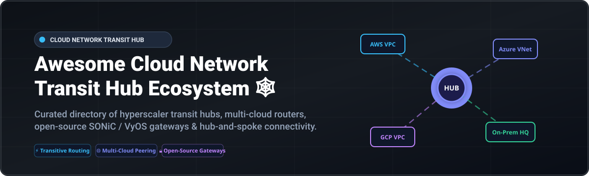

# Awesome-Cloud-Network-Transit-Hub 🕸️ ☁️

  

  
  
  
  
  
  

---

## 🌟 Top Cloud Network Transit Hub Ecosystem 🚀

**Curated Directory of Commercial Cloud Transit Hubs, Multi-Cloud Routers & Open-Source Connectivity Solutions** 🌐  
*Focused on Transitive Routing, Hub-and-Spoke Topology, Multi-Cloud Peering, Network Segmentation & Self-Hosted Virtual Routers* ⚡

**Last updated: October 2026** 📅

---

### 📌 Overview & SEO Summary 🔍

Welcome to the definitive curated directory of **cloud network transit hubs**, **open-source virtual routing platforms**, **multi-cloud interconnect fabrics**, and **overlay network transit architectures**. Whether you are architecting enterprise-grade cloud backbones (using hyperscaler services like *AWS Transit Gateway*, *Azure Virtual WAN*, and *Google Cloud NCC*), integrating multi-cloud overlay solutions (*Aviatrix*, *Alkira*, *Prosimo*), or self-hosting open-source network software (*SONiC*, *VyOS*, *FRRouting*, *Submariner*, *Pritunl*), this repository provides actionable pricing, scale, and feature comparisons for platform engineers and cloud network architects.

**Key Cloud Transit Hub Market Highlights:** 💡
- 💰 **Hyperscaler Dominance**: AWS, Microsoft, and Google dominate the cloud infrastructure transit layer, generating over **$250B+ combined cloud revenue**, with native transit hub gateways acting as primary central routing hubs.
- ⚡ **Open-Source Cost Efficiency**: Replacing managed interconnect routers with open-source software like **SONiC VPP** or **VyOS** delivers up to **30%–50% cost savings** on cloud data transfer and virtual appliance compute fees.
- 🔐 **Multi-Cloud Connectivity & Security**: Specialized overlay providers like **Aviatrix** and **Alkira** offer automated multi-cloud IPsec, BGP dynamic routing, and centralized zero-trust firewall insertion.

---

## 📑 Table of Contents

- [🏢 SaaS & Commercial Platforms](#-saas--commercial-platforms)
- [🔓 Open-Source GitHub Projects](#-open-source-github-projects)
- [🛠️ How to Contribute](#%EF%B8%8F-how-to-contribute)
- [📊 Star History](#-star-history)
- [🤝 Support & Sponsorship](#-support--sponsorship)
- [⚠️ Disclaimer](#%EF%B8%8F-disclaimer)

---

## 🏢 SaaS / Commercial Platforms 💼

> **Market Analysis & Industry Structure:**  
> The Cloud Networking and Transit Hub market is estimated at **$12.5 Billion in 2026** (growing at ~24.5% CAGR). The market is **highly concentrated** (winner-take-most dynamics), dominated by hyperscalers (AWS, Microsoft Azure, Google Cloud) that control 70%+ of cloud network transit traffic through native hub offerings. Third-party multi-cloud overlay platforms (Aviatrix, Alkira, Prosimo) compete in specialized multi-cloud orchestration and L4–L7 security insertion niches.

*Sorted by Company Size / Market Cap / Revenue (Descending)* 📈

| SaaS / Commercial Platform | Company / Owner | Valuation / Market Cap / Size | Standard Edition Starting Price | Free Tier / Free Trial Limits | Description |
| :--- | :--- | :--- | :--- | :--- | :--- |
| **[Azure Virtual WAN](https://azure.microsoft.com/en-us/products/virtual-wan/)** 🔷 | Microsoft | **~$3.1 Trillion** (Market Cap) | **$0.36/hour** per Standard Hub unit + **$0.02/GB** data processed | **1-Month Free Trial** with **$200 free credit** | **Azure-native transit hub** — Optimized branch-to-cloud connectivity. Secured Virtual Hub with integrated Azure Firewall and automated hub-and-spoke VPN/ExpressRoute transit routing. 🌐 |
| **[AWS Transit Gateway](https://aws.amazon.com/transit-gateway/)** ☁️ | Amazon | **~$2.2 Trillion** (Market Cap) | **$0.05/hour** per attachment + **$0.02/GB** data processed | **AWS Free Tier**: **750 hours/month** free compute for select core services | **AWS-native transit hub** — Centralized routing across thousands of VPCs and on-premises networks. Eliminates complex VPC peering meshes with scalable transitive routing and network isolation route tables. ⚡ |
| **[Google Cloud Network Connectivity Center](https://cloud.google.com/network-connectivity-center)** 🌐 | Google (Alphabet) | **~$2.1 Trillion** (Market Cap) | **$0.075/hour** per hub attachment + **$0.01/GB** network transit | **90-Day Free Trial** with **$300 free credits** | **GCP-native transit hub** — Unified hub-and-spoke network connectivity management across GCP VPCs, Hybrid VPN, Interconnect, and third-party router appliances. 🎯 |
| **[Cisco SD-WAN Cloud Hub](https://www.cisco.com/)** 🔵 | Cisco | **~$200 Billion** (Market Cap) | **$125/month** per virtual gateway node (DNA Advantage) | **30-Day Free Trial** for Cisco Catalyst SD-WAN Cloud Manager | **Enterprise SD-WAN transit** — Extends Cisco Catalyst SD-WAN fabric seamlessly into AWS, Azure, and GCP transit hubs with automated overlay orchestration. 🛠️ |
| **[VMware SD-WAN Hub](https://www.vmware.com/)** 🏢 | Broadcom (VMware) | **~$800 Billion** (Broadcom Market Cap) | **$150/month** per edge router subscription license | **60-Day Free Evaluation** license via VMware partner network | **Cloud-delivered SD-WAN hub** — Centralized traffic steering, dynamic multi-path optimization (DMPO), and branch-to-cloud transit routing. 🚀 |
| **[Fortinet FortiGate Cloud Transit](https://www.fortinet.com/)** 🛡️ | Fortinet | **~$60 Billion** (Market Cap) | **$110/month** per VM-01v firewall transit hub instance | **30-Day Free Trial** for FortiGate-VM cloud appliance | **Security-first transit hub** — FortiGate virtual appliances operating as cloud transit hubs with integrated deep packet inspection, IPS, and SSL decryption. 🔐 |
| **[Arista CloudEOS Transit Hub](https://www.arista.com/)** ⚙️ | Arista Networks | **~$110 Billion** (Market Cap) | **$0.95/hour** per CloudEOS router instance (PAYG) | **60-Day Free Trial** with CloudEOS test evaluation license | **Cloud-grade routing hub** — Multi-cloud cloud-native router powered by Arista EOS, featuring BGP EVPN overlays and automated cloud transit integration. 💎 |
| **[Aviatrix Cloud Network Platform](https://aviatrix.com/)** 🚀 | Aviatrix | **~$1.6 Billion** (Valuation) | **$2,500/month** (Enterprise SaaS Base Subscription) | **30-Day Free Trial** on AWS & Azure Marketplace | **Multi-cloud transit platform** — Advanced multi-cloud IPsec overlay, dynamic BGP routing, network segmentation, and enterprise firewall service insertion across AWS, Azure, GCP, and OCI. ⚡ |
| **[Alkira Cloud Network as a Service](https://alkira.com/)** 🎯 | Alkira | **~$500 Million** (Valuation) | **$1,200/month** per CXP (Cloud Exchange Point) node | **30-Day Free Access** with 50 GB free traffic sandbox | **On-demand cloud transit NaaS** — Agentless multi-cloud transit backbone connecting cloud environments, branches, and users with zero hardware deployment. ☁️ |
| **[Prosimo Application Neutral Transit](https://www.prosimo.io/)** 🕸️ | Prosimo | **~$300 Million** (Valuation) | **$1,000/month** (Starter tier for up to 5 multi-cloud transit nodes) | **30-Day Free Trial** sandbox environment | **Autonomous multi-cloud transit** — Combines cloud routing, zero-trust network access (ZTNA), and app performance optimization into a single cloud transit fabric. 🌌 |

---

## 🔓 Open-Source GitHub Projects 🌾

*Sorted by GitHub Stars Count (Descending)* 🌟

- **[FRRouting (FRR)](https://github.com/FRRouting/frr)**   
  **IP routing protocol suite for Linux and Unix platforms** (LGPL-2.1). Includes BGP, OSPF, RIP, IS-IS, and PBR support. Core routing engine used in custom cloud transit gateways and virtual router appliances across cloud environments. ⚡

- **[SONiC (Software for Open Networking in the Cloud)](https://github.com/sonic-net/SONiC)**   
  **Linux-based open-source network operating system for cloud datacenters** (Apache-2.0). Driven by Microsoft and the Open Compute Project. SONiC VPP delivers high-throughput virtual routing and multi-cloud connectivity, replacing expensive commercial cloud transit gateways with **~30%–50% cost savings**. 🌐

- **[Pritunl](https://github.com/pritunl/pritunl)**   
  **Open-source enterprise VPN and multi-cloud routing server** (Custom OS License). Supports OpenVPN and WireGuard with centralized web management, multi-factor authentication, and automated cross-cloud VPC/VNet peering. Popular self-hosted alternative to proprietary transit hubs. 🔐

- **[Submariner](https://github.com/submariner-io/submariner)**   
  **Multi-cluster Kubernetes networking and cross-cloud connectivity engine** (Apache-2.0). Enables direct, encrypted pod-to-pod and service-to-service transit across Kubernetes clusters running on different cloud providers or on-premises datacenters. ☸️

- **[VyOS](https://github.com/vyos/vyos-build)**   
  **Open-source network operating system for software routers and firewalls** (GPL-2.0). Provides BGP, OSPF, IPsec VPN, VXLAN, and NAT. Ideal for building fully custom multi-cloud transit hubs, virtual router appliances, and cloud edge routing nodes without vendor lock-in. ⚙️

- **[Towalink](https://github.com/towalink/towalink)**   
  **Infrastructure-as-Code site connectivity and mesh/transit network manager** (GPL-3.0). Automates WireGuard tunnel establishment, dynamic routing, and central router control for hub-and-spoke and multi-cloud topologies. 🕸️

- **[Invisinets](https://github.com/invisinets/invisinets)**   
  **Multi-cloud networking abstraction framework** (MIT). Published at USENIX NSDI '23, Invisinets simplifies multi-cloud transit configuration by 90% by abstracting away low-level cloud route tables, VPC peering rules, and gateway parameters into intent-driven network connectivity APIs. 🎯

---

## 🛠️ How to Contribute 🤝

Contributions are welcome! Follow these steps to submit new cloud transit platforms or open-source multi-cloud routing tools:

1. 🍴 **Fork** the repository.
2. 📝 **Add/edit** entries in `README.md` maintaining table/list structure and formatting.
3. 🔗 Include project title, official website/GitHub link, exact star count badge, license, starting price, free tier limits, and concise architectural description.
4. 🚀 Submit a **Pull Request** with a descriptive summary of your changes.

---

## 📊 Star History

---

## 🤝 Support & Sponsorship ☕

If you find this cloud network transit hub repository useful, please consider supporting the project:

- ⭐ **Star** this repository to increase visibility!
- 🔀 **Fork** and share with fellow network engineers, platform architects, and DevOps teams.
- ☕ **Sponsor & Buy Me a Coffee**: Support ongoing open-source curation via the [GitHub Sponsor Dashboard](https://github.com/sponsors/ishandutta2007).

---

## ⚠️ Disclaimer ℹ️

- This directory is a **community-curated list** — provided for informational and architectural comparison purposes only. ℹ️
- **Cost Considerations**: AWS Transit Gateway, Azure Virtual WAN, and GCP Network Connectivity Center charge per-hour attachment fees and data processing costs. Evaluate data volume before deploying central hub topologies. 💰
- **Self-Hosted Open-Source Gateway Risks**: Operating open-source transit hubs (e.g. VyOS, FRRouting, SONiC) requires high networking expertise (BGP tuning, IPsec key management, high-availability failover). Always perform proof-of-concept testing prior to production rollout. 🛡️

---

  <b>Made with ❤️ for cloud architects, network engineers, and open-source connectivity advocates.</b>

